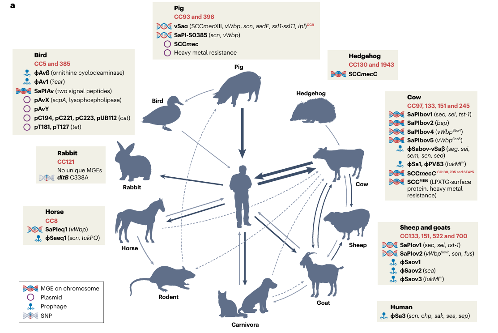

# ***Stphylococcus Aureus***

## Basic information:

- gram positive, facultative coccus
- many different hosts:  

- 2.8 - 2.9 million bp genome size encoding:
  - core genome genes (~1441 genes)
  - accessory genomes (~7411 genes)
- many different strains: 
  - common commensal colonizer of the skin and nasal cavities (20-30% humans are asymptomatic carriers)
  - some strains colonize and cause diseases and become latent pathogens
  - there are small-colony variants (SCVs)
  - both commensal and pathogenic S. aureus strains are genetically diverse and can switch roles depending on host and environmental factors

Major strain types:
Strain Name Type	                |Stands For / Description	                                            |Key Features / Notes	                                    |Citation
------------------------------------|-----------------------------------------------------------------------|-----------------------------------------------------------|---------
MRSA252                             |Methicillin-Resistant S. aureus, strain 252	                        |Hospital-acquired, epidemic, highly diverse genome	        |4, 2
MSSA476	                            |Methicillin-Susceptible S. aureus, strain 476	                        |Community-acquired, contains unique resistance element	    |4
USA300	                            |Pulsed-field gel electrophoresis (PFGE) type USA300, MLST type 8, CC8	|Major US community-associated MRSA, highly virulent	    |6, 7, 8
USA300-0114	                        |Specific USA300 isolate, widely disseminated in the US	                |Carries PVL toxin, SCCmec IVa, multiple resistances	    |6
USA100, USA400, USA500	            |Other PFGE types of S. aureus in the US	                            |Distinct lineages with unique gene sets	                |6
EMRSA-16 (ST36)	                    |Epidemic MRSA, sequence type 36	                                    |Hospital-acquired, globally prevalent	                    |4
EMRSA-15 (ST22)	                    |Epidemic MRSA, sequence type 22	                                    |Hospital-acquired, globally prevalent	                    |5
ST22 (Lr2)	                        |Sequence Type 22, Lr2 isolate from Pakistan	                        |PVL and TSST positive, highly virulent	                    |5
SG511-Berlin	                    |Laboratory strain, hypersusceptible to antibiotics	                    |Used for antibiotic screening, lacks resistance genes	    |2
Newman	                            |Human clinical isolate, robust virulence in animal models	            |Antibiotic-susceptible, carries multiple prophages	        |8
NCTC8325, COL	                    |Laboratory and clinical reference strains	                            |Used in research, related to Newman and USA300	            |8
MW2, N315, Mu50, JH1, JH9, RF122	|Clinical isolates with varying resistance and virulence profiles	    |Used for comparative genomics	                            |8

1. N/A
2. https://www.sciencedirect.com/science/article/pii/S1438422121000746?via%3Dihub
3. N/A
4. https://www.pnas.org/doi/full/10.1073/pnas.0402521101
5. https://www.mdpi.com/2079-6382/11/4/496
6. https://journals.asm.org/doi/10.1128/jcm.44.1.108-118.2006
7. https://academic.oup.com/jac/article-abstract/64/3/441/776075?redirectedFrom=fulltext
8. https://journals.asm.org/doi/10.1128/jb.01000-07

### The ones we need to care about:
   - !!Fill in later once email gets

- diseases and pathogenicity: cause skin infections, food poisoning, pneumonia, endocarditis, osteomyelitis, toxic shock syndrome, and severe cases with bacteremia
- has various virulence factors and forms biofilms

## Potential Antigen Targets:

1. Microbial surface components recognising adhesive matrix molecules **(MSCRAMMs)**:
   1. Serine-aspartate repeat protein **(SdrD, SdrE)**
2. Extracellular adherence protein **(Eap, EAPH1, EapH2)**
3. Superantigens **(sAgs)**:
   1. Toxic shock syndrome toxin-1 **(TSST-1)**
   2. Staphylococcal enterotoxins B, C, like X **(*seb, sec, selX*)**
   3. Protein A **(SpaA)**
   4. Staphylococcal enterotoxin-like toxin X, W **(SElX, SElW)**
   5. Staphylococcal superantigen-like proteins **(SSL1, SSL3, SSL5, SSL6, SSL7, SSL10, SSL11, SSL13)**
4. Fibronectin-binding protein **(FnbpB)**
5. Staphylococcal nuclease **(Nuc)**
6. Adenosine synthase A **(AdsA)**
7. Nucleosides **(Ado, dAdo)**
8. Biocompetent pore-forming toxins **(leukocidins: LukAB, LukSF-PV, PVL)**
9. Phenol-soluble modulins **(PSMs)**
10. Staphylococcal peroxidase inhibitor **(SPIN)**
11. *S. aureus* γ-haemolysin **(HlgAB)**
12. Staphylococcal immunoglobulin-binding protein **(Sbi)**

### Complete list of *S. aureus* virulence factors:

**Name** |**Gene** |**Target** |**Action** |**Key characteristics** 
-----|-----|-------|-------|-------------------
Adenosine synthase A |adsA |ATP, dAMP |Increase adenosine, anti-inflammatory, suppress ROS in phagocytes. Generate dAdo from NETs, blocks caspase 3, apoptosis of macrophages. Inhibits Th1/Th17 immunity by attenuating NLRP3-mediated release of IL-1β |Cell wall anchored enzyme; core genome encoded
Aureolysin |aur |C3 |Zinc-dependent metalloprotease, Inhibits phagocytosis and complement  |Core genome 
Capsule |Cap operon (capA-P) |Unknown |Inhibition of phagocytosis |Serotype 5 and 8 dominant in clinical isolates 
Chemotaxis inhibitory protein (CHIPS) |chp |FPR1, C5aR |Inhibition of chemotaxis |Core genome encoded
Clumping factor A (ClfA) |clfA |γ-fibrinogen and factor I  |Attachment; inhibition of phagocytosis |Core genome encoded 
Collagen adhesin |cna |C1q  |Adhesion (collagen), C1q binding |Variable 
Coagulase |coa |Prothrombin, fibrinogen |Inhibition of phagocytosis |Core genome encoded 
Extracellular adherence proteins (Eap, EAPH1, EapH2) |Eap, eapH1, eapH2 |ICAM1, C4b (eap), elastase, cathepsin G and proteinase 3 (eap, eapH1,H2) |Inhibition of phagocytic killing; preserve PSM function 55 (eap, eapH1, eapH2), Complement inhibition (eap) |Core genome encoded 
Enterotoxins B, C, -like X |seb, sec, selX |Vβ TCR (seb, sec) PSGL1 (selX) |T cell superantigen |Pathogenicity island (seb, sec), Core (selX) 
Ecb, Efb |ecb, efb |C3d (ecb, efb), αMβ2 integrin (efb) |Inhibition of complement |IEC2 (immune evasion cluster/island) 
FLIPr, FLIPrL |flipr, fliprl |FPR2 (flipr, fliprl), FPR1 (fliprl) |Inhibition of chemotaxis |IEC2 (immune evasion cluster/island)
Fibronectin-binding protein A (FnBPA) | fnbpA | γ-fibrinogen, fibronectin | Inhibition of phagocytosis, invasion | Core genome encoded
Fibronectin-binding protein B (FnBPB) | fnbpB | Histones, plasminogen | Protects against antimicrobial activity of histones | Core genome encoded
γ-haemolysin AB (HlgAB) and CB (HlgCB) | hlgAB, hlgCB | CXCR1, CXCR2, CCR2, DARC (HlgAB), C5aR1/2 (HlgCB) | Phagosome escape | Secreted bicomponent leukocidins. Both high activity against human cells. HlgCB low activity in mice.
Leukocidin AB (LukAB) [LukGH] | lukAB | CD11b, HVCN1 | Neutrophil lysis, Contribution to dendritic cell inhibition. |High activity against human cells, low activity in mice. Clonal complex specific sequence variability linked to alternate targets.
Leukocidin ED | lukED | CXCR1, CXCR2, CCR5, DARC | Neutrophil lysis | Genomic island β (Giβ)
Leukocidin SF-PV (PVL) | lukFS | hC5aR1/2 (S component), CD45 (F component) | Neutrophil lysis | Encoded on PVL prophage ΦSa2. Highly active against human cells, no activity against mouse cells. hC5aR1 dissociation from toxin may amplify inflammatory response.
Phenol soluble modulins (PSMs) | psmα1-4, psmβ1-2 | FPR2 | Neutrophil lysis | Core genome encoded
Delta-toxin (δ) | hld | Not known | Mast cell degranulation | PSM family. Core genome encoded, allelic variants have impact on pathogenesis
Protein A (SpaA) | spaA | Ig Fc, Ig Fab | Inhibition of phagocytosis, B cell superantigen. Inhibit IgG hexamerization and complement |Core genome encoded, Ig binding domain highly conserved, variable cell wall spanning domain.
Staphylococcal binder of immunoglobulin (Sbi) | sbi | IgG Fcγ, C3, factor H | Inhibition of phagocytosis | N/A
Serine-aspartate repeat protein D (SdrD) | sdrD | Dsg 1, uncertain | Adherence and abscess formation, Promotes survival in human blood | Variably present.Well described to promote binding to nasal epithelium and promote abscess formation. Innate immune evasion function
Serine-aspartate repeat protein E (SdrE) | sdrE | Complement factor H | Inhibition of complement activity | N/A
SEIW | selw | T-cell | T-cell mitogen | Present in majority of S. aureus. Truncated in some clones.
Staphylococcal enterotoxin-like toxin X (SEIX) | selX | PSGL1 | Superantigen activity, survival in human blood | Core genome encoded. An "SSL-like" sAg.
Staphylococcal superantigen-like protein 1 (SSL1) | ssl1 | MMPs | Inhibition of matrix metalloproteinases and neutrophil activation | Genomic island α (Giα)
Staphylococcal superantigen-like protein 3 (SSL3) | ssl3 | TLR2 | Toll-like receptor inhibition | Genomic island α (Giα)
Staphylococcal superantigen-like protein 5 (SSL5) | ssl5 | PSGL1, GPCRs, GPlbα, GPVI, MMPs | Chemotaxis and platelet inhibition | Inhibition of matrix metalloproteinases and neutrophil activation. Genomic island α (Giα)
Staphylococcal superantigen-like protein 6 (SSL6) | ssl6 | PSGL1 | Inhibition of chemotaxis | Genomic island α (Giα)
Staphylococcal superantigen-like protein 7 (SSL7) | ssl7 | C5, IgA | Inhibition of phagocytosis | Genomic island α (Giα)
Staphylococcal superantigen-like protein 10 (SSL10) | ssl0 | IgG, fibrinogen, fibronectin, thrombin, factor Xa | Inhibition of phagocytosis | Genomic island α (Giα)
Staphylococcal superantigen-like protein 11 (SSL11) | ssl1 | PSGL1 | Inhibition of chemotaxis | Genomic island α (Giα)
Staphylococcal superantigen-like protein 13 (SSL13) | Ssl13 | FPR2 | Promotes neutrophil recruitment | Genomic island α (Giα)
Staphylococcal complement inhibitor (SCIN) | scn, scnB, scnC | C3bBb | Inhibition of complement | IEC2 (immune evasion island)
Staphylococcal peroxidase inhibitor (SPIN) | spn, NWMN_0402 | Myeloperoxidase (MPO) | Upregulated following phagocytosis, evasion of MPO-dependent killing | Located in conserved region of genomic island νSaα
Staphylokinase | sak | Plasminogen, fibronectin, C3, IgG , Antimicrobial Peptides| Inhibition of phagocytosis, inhibition of action | IEC1 (immune evasion island)
Staphopain cysteine protease | scpA | CXCR2 | Inhibition of chemotaxis | Core genome encoded
Toxic shock syndrome toxin-1 (TSST1) | tst | Vβ2 TCR, MHC class II α-chain | T cell superantigen | Pathogenicity island, SaPI1
Von Willebrand factor-binding protein (vWbp) | vwb | Prothrombin, fibrinogen, factor XIII, fibronectin | Inhibition of phagocytosis | Core genome encoded

### Sequence motifs for *S. aureus* antigens:??? **(FIND OUT)**

## ANALYSIS STEPS:
1. Go through literature to get a list of potential antigens (list above) *done: data/literature-sourced/S.aureus/Howden2023_S.aureus_virulence-factor-list.xlsx*
2. Go through IEDB to get a list of potential antigens (https://www.iedb.org/home_v3.php) *done: data/literature-sourced/S.aureus/IEDB_S.aureus_antigen_table.xlsx*
   - NOTE: Figure out how to do this without going to the website: can download the whole database: (https://www.iedb.org/database_export_v3.php) - but have to automate the downloading and updating (via weekly CI/CD pipeline)
3. Vaccine database & Patent database to get a list of potential antigens **!Figure out the suitable databases**
4. Fetch the amino acid sequence for all antigens of all strains of *S. aureus*:
    - use the NCBI protein database UniProt to get the prot sequence of potential antigens
    - > figure out how to automate fetching without(?) using the Web API for efficiency
    - URL destination: https://eutils.ncbi.nlm.nih.gov/entrez/eutils/
    - Docummentation: https://www.ncbi.nlm.nih.gov/books/NBK25497/
    - use Entrez Direct unix CL tool: https://www.ncbi.nlm.nih.gov/books/NBK179288/
5. Analyse the protein sequence for sequence motifs and features that makes them good antigens for *S. aureus* **!Find or create script to do this**

6. Fetch the amino acid sequence for the targets of the antigens:
    - get the PDB identifier of each protein (MHC1, MHC2, T-cell, B-cell)
    - use search query: https://search.rcsb.org/rcsbsearch/v2/query
      - Tutorial: https://search.rcsb.org/index.html#search-api
        - return type: entry (list of PDB IDs)
        - query language: full query DSL (domain-specific language) based on JSON
      - `In GET method, search request should be sent as a URL-encoded query string in json parameter: https://search.rcsb.org/rcsbsearch/v2/query?json={search-request}.`
    - use: https://www.rcsb.org/docs/programmatic-access/web-apis-overview to fetch aa seq.
    - 