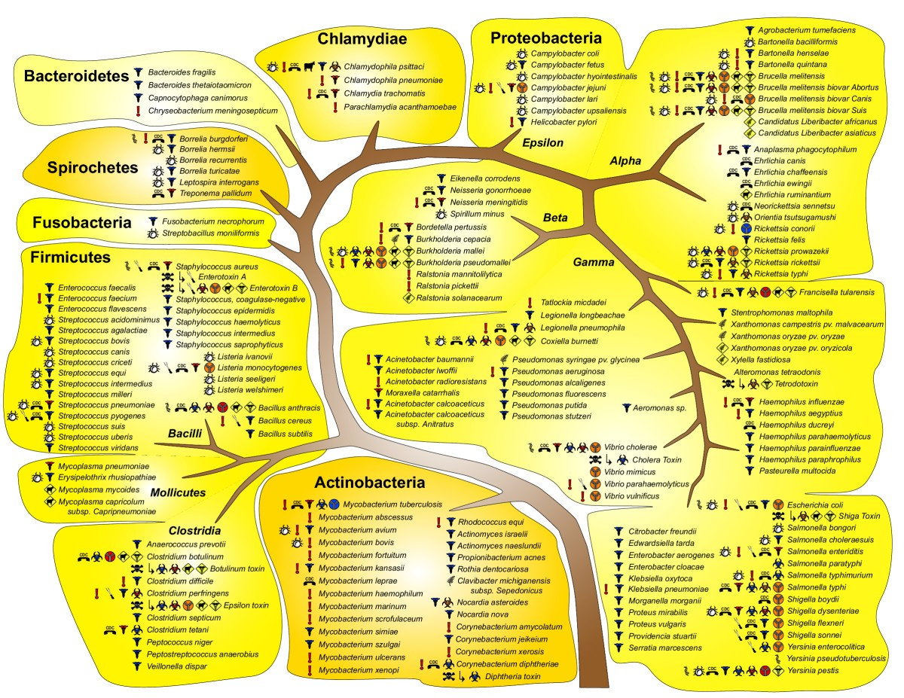

Existing mRNA Vaccines used for:
- COVID-19: BNT162b2, 
- Zika virus
- Influenza

## Pipeline steps for epitope selection, prediction, and evaluation:

1. Choose pathogen of interest:
Universal Flu (influnenza),Staphylococcus aureus,Lupus (mCAR),Chronic HepB

2. Survey existing literature to understand mechanism of actiona and attempted treatments

3. Select target proteins (review common ones from other pathogens to get ideas)

4. Retrieve amino acid sequence from the NCBI protein database

5. Predict epitopes of the protein - use Immune Epitope Database and Analysis Resource (IEDB)
    5.1. predict MHC-1 epitopes - binds with MHC-1 for all cell antigen presentation
    5.2. predict MHC-2 epitopes - binds with MHC-2 of antigen presenting cells to trigger adaptive immune response
    5.3. predict B cell epitopes - binds with B cells to initiate antibody production and immunity memory

6. Evaluate epitopes:
- allergenicity
- antigenicity
- population coverage
- conservancy
- secondary structure prediction
- protein protein interaction with MHC-1 (molecular docking)
- generation of IFN-y
- predict presence and location of signal peptides, mitochondrial, chloroplast, and thylakoid luminal transit peptides

## Tools to use:

- Machine learning:
    - feed-forward neural networks
    - restricted boltzmann machine (RBM)
    - deep learning
    - convolutional neural networks (CNNs)
    - decision trees
    - language models
    - attention mechanism
    - generative models

- NCBI bioinformatic databases (https://www.ncbi.nlm.nih.gov): to get FASTA of proteins/antigens amino acid sequence
    - BLASTp (https://blast.ncbi.nlm.nih.gov/Blast.cgi?PAGE=Proteins) - assess identity of epitopes to human proteins
- protein data bank (https://www.rcsb.org/): to get the target proteins which the antigens interact with: MHC1, MHC2, B-cell, T-cell etc
- IEDB (https://www.iedb.org/):
    - MHC-1 binding prediction tool (http://tools.iedb.org/mhci/, https://nextgen-tools.iedb.org/)
    - MHC-2 binding prediction tool (http://tools.iedb.org/mhcii/, https://nextgen-tools.iedb.org/)
    - B cell epitope prediction - multiple methods
    - T-cell epitope populatoin coverage (http://tools.iedb.org/population/)
    - conservation analysis tool (http://tools.iedb.org/conservancy/)

- Prebuilt tools:
    - NetMHCpan (artificial neural network) - HLA allele binding/interaction prediction
    - [AllerTOP v.2.1](https://www.ddg-pharmfac.net/allertop_test/) - testing epitopes allergenicity *most accurate at 88.7%*
    - [AlgPred](http://crdd.osdd.net/raghava/algpred/) - testing epitopes allergenicity
    - [AllergenFP](https://ddg-pharmfac.net/AllergenFP/) - testing epitopes allergenicity
    - [VaxiJen](https://www.ddg-pharmfac.net/vaxijen3/home/) - testing epitope immunogenicity
    - [IFNepitope](http://crdd.osdd.net/raghava/ifnepitope/) - analyse epitope capacity to generate interferon-gamma (IFN-y) *max accuracy 82.10%*
    - [SignalP](https://services.healthtech.dtu.dk/services/SignalP-5.0/)and [TargetP](https://services.healthtech.dtu.dk/services/TargetP-2.0/) - predict and localize proteins and peptides
    - [PEP-FOLD 3.0](https://bioserv.rpbs.univ-paris-diderot.fr/services/PEP-FOLD3/)
    - [TMHMM 2.0](https://services.healthtech.dtu.dk/services/TMHMM-2.0/)
    - [CLBTope](https://webs.iiitd.edu.in/raghava/clbtope/) - prediction of Linear & Conformational B-cell Epitopes
    - [Ellipro](http://tools.iedb.org/ellipro/) - predicts linear and discontinuous antibody epitopes based on a protein antigen's 3D structure (PDB file)
    - [IL-10Pred](https://webs.iiitd.edu.in/raghava/il10pred/) - Prediction of Interleukin-10 inducing peptides
    - [IL4pred](http://crdd.osdd.net/raghava/il4pred/) - Prediction of Interleukin-4 inducing peptides
    - 

- observe protein-protein interactions between HLA/MHC with epitopes (molecular docking):
    - Autodock Vina
    - Autodock
    - CrankPep (ADCP)
    - HPEPDOCK

## IEDB
> use data from all recent paper publications taken from pubMed

MHC I alleles included: 

`27 Allele panel:Covers 97% of the human population
    HLA-A*01:01, HLA-A*02:01, HLA-A*02:03, HLA-A*02:06, HLA-A*03:01, HLA-A*11:01, HLA-A*23:01, HLA-A*24:02, HLA-A*26:01, HLA-A*30:01, HLA-A*30:02, HLA-A*31:01, HLA-A*32:01, HLA-A*33:01, HLA-A*68:01, HLA-A*68:02, HLA-B*07:02, HLA-B*08:01, HLA-B*15:01, HLA-B*35:01, HLA-B*40:01, HLA-B*44:02, HLA-B*44:03, HLA-B*51:01, HLA-B*53:01, HLA-B*57:01, HLA-B*58:01, 
`

MHC II alleles included:

`7 Allele panel:Representative of the main class II human supertypes
HLA-DRB1*03:01, HLA-DRB1*07:01, HLA-DRB1*15:01, HLA-DRB3*01:01, HLA-DRB3*02:02, HLA-DRB4*01:01, HLA-DRB5*01:01, 
`

`
27 Allele panel:Covers 97% of the human population
HLA-DRB1*01:01, HLA-DRB1*03:01, HLA-DRB1*04:01, HLA-DRB1*04:05, HLA-DRB1*07:01, HLA-DRB1*08:02, HLA-DRB1*09:01, HLA-DRB1*11:01, HLA-DRB1*12:01, HLA-DRB1*13:02, HLA-DRB1*15:01, HLA-DRB3*01:01, HLA-DRB3*02:02, HLA-DRB4*01:01, HLA-DRB5*01:01, HLA-DQA1*05:01/DQB1*02:01, HLA-DQA1*05:01/DQB1*03:01, HLA-DQA1*03:01/DQB1*03:02, HLA-DQA1*04:01/DQB1*04:02, HLA-DQA1*01:01/DQB1*05:01, HLA-DQA1*01:02/DQB1*06:02, HLA-DPA1*02:01/DPB1*01:01, HLA-DPA1*01:03/DPB1*02:01, HLA-DPA1*01:03/DPB1*04:01, HLA-DPA1*03:01/DPB1*04:02, HLA-DPA1*02:01/DPB1*05:01, HLA-DPA1*02:01/DPB1*14:01 
`

# Pathogens tested:
## Staphylococcus aureus

### Type of Bacteria:
- Staphylococcus aureus is a Gram-positive bacterium.

### Characteristics:
- Spherical (coccus) in shape.
- Forms clusters resembling grape-like structures.
- Facultative anaerobe (can grow in both aerobic and anaerobic conditions).
- Non-motile and non-spore-forming.
- Produces a golden-yellow pigment (staphyloxanthin) on nutrient agar.

### Genome Size:
- Approximately 2.8–2.9 million base pairs (Mb).
- Contains around 2,500 genes.

### Infection Target:
- Commonly infects skin and soft tissues.
- Can cause invasive infections such as:
    - Pneumonia
    - Endocarditis
    - Osteomyelitis
    - Sepsis
    - Toxic shock syndrome
- Known for forming biofilms on medical devices (e.g., catheters, prosthetics).

### Virulence Factors:
- Produces toxins such as:
    - Alpha-toxin
    - Panton-Valentine leukocidin (PVL)
    - Enterotoxins (cause food poisoning)
- Enzymes like coagulase and hyaluronidase aid in tissue invasion.
- Protein A binds to the Fc region of antibodies, evading immune response.

### Antibiotic Resistance:
- Methicillin-resistant Staphylococcus aureus (MRSA) strains are a major concern in healthcare settings.
- Resistance to beta-lactam antibiotics is mediated by the mecA gene.

### Habitat:
- Found as part of the normal flora on human skin and mucous membranes, particularly in the nasal passages.

### Pathogenicity:
- Opportunistic pathogen that can cause infections when the immune system is compromised or when there is a breach in the skin barrier.

### Strains of Interest:
- MSSA476 (BX571857)
- N315 (BA000018)
- NCTC 8325 (CP000253)
- HO 5096 0412 (HE681097)
- MRSA252 (BX571856)
- JKD6159 (CP002114)

## Chlamydia trachomatis

### Type of Bacteria:
- Chlamydia trachomatis is a Gram-negative bacterium.

### Characteristics:
- Obligate intracellular pathogen.
- Non-motile and non-spore-forming.
- Exhibits a biphasic developmental cycle with two forms:
    - Elementary body (EB): Infectious, extracellular form.
    - Reticulate body (RB): Non-infectious, intracellular replicative form.

### Genome Size:
- Approximately 1.0–1.2 million base pairs (Mb).
- Contains around 900–1,100 genes.

### Infection Target:
- Infects epithelial cells of the urogenital tract, eyes, and respiratory tract.
- Can cause diseases such as:
    - Trachoma (leading cause of preventable blindness).
    - Urogenital infections (e.g., pelvic inflammatory disease, infertility).
    - Neonatal pneumonia and conjunctivitis.

### Virulence Factors:
- Type III secretion system (T3SS) for injecting effector proteins into host cells.
- Heat shock proteins (HSPs) that modulate immune response.
- Outer membrane proteins (e.g., MOMP) for adhesion and immune evasion.

### Antibiotic Resistance:
- Resistance to macrolides, tetracyclines, and fluoroquinolones has been reported but remains rare.

### Habitat:
- Found in human epithelial cells; transmitted through sexual contact, perinatal exposure, or direct contact with infected secretions.

### Pathogenicity:
- Causes chronic infections by evading immune detection and inducing inflammation.

### Strains of Interest:
- L2/434/Bu (ATCC VR-902B): Commonly used in research; associated with lymphogranuloma venereum (LGV).
- D/UW-3/Cx: A reference strain for urogenital infections.
- A/HAR-13: Associated with trachoma, a leading cause of blindness.
- E/Bour: Frequently isolated from urogenital infections.

## Helicobacter pylori

### Type of Bacteria:
- Helicobacter pylori is a Gram-negative bacterium.

### Characteristics:
- Spiral-shaped (helical) with flagella for motility.
- Microaerophilic (requires low oxygen levels).
- Urease-positive, enabling survival in acidic environments like the stomach.

### Genome Size:
- Approximately 1.6–1.7 million base pairs (Mb).
- Contains around 1,500–1,600 genes.

### Infection Target:
- Colonizes the gastric mucosa.
- Associated with diseases such as:
    - Gastritis
    - Peptic ulcers
    - Gastric cancer
    - Mucosa-associated lymphoid tissue (MALT) lymphoma.

### Virulence Factors:
- Urease enzyme neutralizes stomach acid.
- Cytotoxin-associated gene A (CagA) protein disrupts cellular signaling.
- Vacuolating cytotoxin A (VacA) induces cell damage.
- Adhesins (e.g., BabA, SabA) facilitate attachment to gastric epithelial cells.

### Antibiotic Resistance:
- Resistance to clarithromycin, metronidazole, and levofloxacin is increasingly common.

### Habitat:
- Found in the human stomach; transmitted via oral-oral or fecal-oral routes.

### Pathogenicity:
- Persistent colonization and inflammation can lead to chronic gastritis and gastric malignancies.

### Strains of Interest:
- 26695: A well-studied reference strain.
- J99: Isolated from a patient with duodenal ulcer disease.
- G27: Commonly used in research for studying pathogenesis.
- B8: Associated with gastric cancer.

## Neisseria gonorrhoeae

### Type of Bacteria:
- Neisseria gonorrhoeae is a Gram-negative bacterium.

### Characteristics:
- Diplococcal (pairs of spherical cells) in shape.
- Non-motile and non-spore-forming.
- Obligate aerobe but can grow in microaerophilic conditions.
- Oxidase-positive and catalase-positive.
- Exhibits a characteristic "kidney bean" shape under the microscope.

### Genome Size:
- Approximately 2.1–2.2 million base pairs (Mb).
- Contains around 2,000–2,100 genes.

### Infection Target:
- Infects mucosal surfaces of the urogenital tract, rectum, pharynx, and conjunctiva.
- Can cause diseases such as:
    - Gonorrhea
    - Pelvic inflammatory disease (PID)
    - Epididymitis
    - Disseminated gonococcal infection (DGI)
    - Neonatal conjunctivitis (ophthalmia neonatorum)

### Virulence Factors:
- Pili and outer membrane proteins (e.g., Opa, PorB) facilitate adhesion and invasion.
- Lipooligosaccharide (LOS) triggers inflammation and immune evasion.
- IgA protease degrades host antibodies.
- Phase and antigenic variation mechanisms allow immune evasion.

### Antibiotic Resistance:
- Resistance to penicillin, tetracyclines, fluoroquinolones, and macrolides is widespread.
- Increasing resistance to extended-spectrum cephalosporins (e.g., ceftriaxone) is a major public health concern.

### Habitat:
- Found in the human urogenital tract and transmitted through sexual contact or perinatal exposure.

### Pathogenicity:
- Strict human pathogen that causes localized infections and systemic complications if untreated.

### Strains of Interest:
- FA1090: A well-studied strain used in research on pathogenesis and antibiotic resistance.
- MS11: Frequently used in studies of pili and antigenic variation.
- NCCP11945: A reference strain for genomic studies.
- WHO reference strains (e.g., WHO F, WHO K): Used for monitoring antimicrobial resistance.

## Streptococcus pneumoniae

### Type of Bacteria:
- Streptococcus pneumoniae is a Gram-positive bacterium.

### Characteristics:
- Spherical (coccus) in shape.
- Typically forms pairs (diplococci) but can also appear in short chains.
- Facultative anaerobe (can grow in both aerobic and anaerobic conditions).
- Non-motile and non-spore-forming.
- Encapsulated with a polysaccharide capsule, which is a major virulence factor.

### Genome Size:
- Approximately 2.0–2.1 million base pairs (Mb).
- Contains around 2,000 genes.

### Infection Target:
- Commonly infects the respiratory tract.
- Can cause diseases such as:
    - Pneumonia
    - Otitis media
    - Sinusitis
    - Meningitis
    - Bacteremia
- Particularly affects young children, the elderly, and immunocompromised individuals.

### Virulence Factors:
- Polysaccharide capsule prevents phagocytosis.
- Pneumolysin toxin damages host cells and activates the immune response.
- Surface proteins (e.g., PspA, PspC) aid in adhesion and immune evasion.
- Autolysin (LytA) contributes to cell lysis and release of virulence factors.

### Antibiotic Resistance:
- Resistance to beta-lactam antibiotics (e.g., penicillin) is mediated by alterations in penicillin-binding proteins (PBPs).
- Macrolide resistance is also common due to efflux pumps or ribosomal modifications.

### Habitat:
- Found as part of the normal flora in the human nasopharynx.
- Transmission occurs via respiratory droplets.

### Pathogenicity:
- Opportunistic pathogen that can cause invasive infections when host defenses are compromised.
### Strains of Interest:
- TIGR4 (AE005672): A widely studied strain associated with invasive pneumococcal disease.
- D39 (CP000410): A laboratory strain commonly used in virulence and vaccine research.
- R6 (AE007317): A non-encapsulated strain used for genetic studies.
- Hungary19A-6 (CP000936): A multidrug-resistant strain prevalent in clinical settings.
- Taiwan19F-14 (CP002121): A strain associated with antibiotic resistance and global spread.
- Spain23F-1 (CP000918): A strain known for its high virulence and resistance profile.
- ST306 (CP002176): A strain associated with outbreaks of meningitis.
- G54 (CP001015): A strain used in studies of pneumococcal pathogenesis.
- A66.1 (CP000918): A serotype 3 strain associated with high mortality rates.
- 70585 (CP000918): A serotype 4 strain used in vaccine development research.
- ATCC 6303: A reference strain used in vaccine efficacy studies.
- SPN23F (CP003646): A serotype 23F strain linked to invasive diseases in children.

## Streptococcus pyogenes

### Type of Bacteria:
- Streptococcus pyogenes is a Gram-positive bacterium.

### Characteristics:
- Spherical (coccus) in shape.
- Typically forms chains or pairs.
- Facultative anaerobe (can grow in both aerobic and anaerobic conditions).
- Non-motile and non-spore-forming.
- Beta-hemolytic on blood agar, producing clear zones of hemolysis.

### Genome Size:
- Approximately 1.8–2.0 million base pairs (Mb).
- Contains around 1,700–1,900 genes.

### Infection Target:
- Commonly infects the throat and skin.
- Can cause diseases such as:
    - Pharyngitis (strep throat)
    - Scarlet fever
    - Impetigo
    - Cellulitis
    - Necrotizing fasciitis (flesh-eating disease)
    - Streptococcal toxic shock syndrome
    - Rheumatic fever
    - Post-streptococcal glomerulonephritis

### Virulence Factors:
- M protein aids in immune evasion and adhesion to host cells.
- Streptolysins (O and S) cause cell lysis.
- Hyaluronic acid capsule prevents phagocytosis.
- Pyrogenic exotoxins (Spe) act as superantigens, triggering severe immune responses.
- Enzymes like streptokinase and hyaluronidase facilitate tissue invasion.

### Antibiotic Resistance:
- Generally sensitive to penicillin, but resistance to macrolides (e.g., erythromycin) and tetracyclines has been reported.

### Habitat:
- Found as part of the normal flora in the human throat and skin.
- Transmission occurs via respiratory droplets, direct contact, or contaminated surfaces.

### Pathogenicity:
- Opportunistic pathogen that can cause severe invasive infections and post-infectious complications.

### Strains of Interest:
- MGAS5005: A strain used in studies of virulence and immune evasion.
- MGAS8232: Associated with invasive infections like necrotizing fasciitis.
- SF370: A reference strain used for genomic studies.
- M1T1: Known for its hypervirulent phenotype and association with severe invasive diseases.

## Mycoplasma pneumoniae

### Type of Bacteria:
- Mycoplasma pneumoniae is a Gram-negative bacterium.

### Characteristics:
- Lacks a cell wall, making it resistant to beta-lactam antibiotics.
- Pleomorphic in shape (can change shape).
- Obligate aerobe (requires oxygen for growth).
- Non-motile and non-spore-forming.

### Genome Size:
- Approximately 0.8–1.0 million base pairs (Mb).
- Contains around 700–1,000 genes.

### Infection Target:
- Infects the respiratory tract.
- Causes diseases such as:
    - Atypical pneumonia (walking pneumonia)
    - Tracheobronchitis
    - Pharyngitis

### Virulence Factors:
- Adhesins (e.g., P1 protein) facilitate attachment to respiratory epithelial cells.
- Production of hydrogen peroxide damages host cells.
- Evades immune response by varying surface proteins.

### Antibiotic Resistance:
- Resistance to macrolides (e.g., azithromycin) has been reported.

### Habitat:
- Found in the human respiratory tract.
- Transmission occurs via respiratory droplets.

### Pathogenicity:
- Causes persistent infections by evading the immune system.

### Strains of Interest:
- M129: A reference strain used in genomic studies.
- FH: Frequently used in research on pathogenesis.

## Clostridium difficile

### Type of Bacteria:
- Clostridium difficile is a Gram-positive bacterium.

### Characteristics:
- Rod-shaped (bacillus).
- Obligate anaerobe (grows in the absence of oxygen).
- Spore-forming, allowing survival in harsh environments.
- Produces toxins that cause disease.

### Genome Size:
- Approximately 4.0–4.3 million base pairs (Mb).
- Contains around 3,500–4,000 genes.

### Infection Target:
- Infects the gastrointestinal tract.
- Causes diseases such as:
    - Antibiotic-associated diarrhea
    - Pseudomembranous colitis

### Virulence Factors:
- Toxin A (TcdA) and Toxin B (TcdB) disrupt the intestinal epithelium.
- Surface layer proteins aid in adhesion to host cells.

### Antibiotic Resistance:
- Resistance to fluoroquinolones and clindamycin is common.

### Habitat:
- Found in the human gut microbiota and the environment.
- Transmission occurs via the fecal-oral route.

### Pathogenicity:
- Opportunistic pathogen that causes disease after disruption of the gut microbiota.

### Strains of Interest:
- R20291: A hypervirulent strain associated with outbreaks.
- 630: A reference strain used in research.

## Mycobacterium tuberculosis

### Type of Bacteria:
- Mycobacterium tuberculosis is a Gram-positive bacterium.

### Characteristics:
- Rod-shaped (bacillus).
- Acid-fast due to a high lipid content in the cell wall.
- Obligate aerobe (requires oxygen for growth).
- Non-motile and non-spore-forming.

### Genome Size:
- Approximately 4.4 million base pairs (Mb).
- Contains around 4,000 genes.

### Infection Target:
- Infects the lungs but can disseminate to other organs.
- Causes tuberculosis (TB).

### Virulence Factors:
- Mycolic acids and glycolipids in the cell wall prevent phagosome-lysosome fusion.
- ESX secretion systems aid in immune evasion.

### Antibiotic Resistance:
- Multidrug-resistant (MDR) and extensively drug-resistant (XDR) strains are a major concern.

### Habitat:
- Found in human hosts; transmitted via respiratory droplets.

### Pathogenicity:
- Causes chronic infections and can remain latent for years.

### Strains of Interest:
- H37Rv: A reference strain used in research.
- CDC1551: Known for its high virulence.

## Mycobacterium leprae

### Type of Bacteria:
- Mycobacterium leprae is a Gram-positive bacterium.

### Characteristics:
- Rod-shaped (bacillus).
- Acid-fast due to a high lipid content in the cell wall.
- Obligate intracellular pathogen.
- Non-motile and non-spore-forming.

### Genome Size:
- Approximately 3.3 million base pairs (Mb).
- Contains around 1,600 genes.

### Infection Target:
- Infects skin and peripheral nerves.
- Causes leprosy (Hansen's disease).

### Virulence Factors:
- Phenolic glycolipid-1 (PGL-1) aids in adhesion to Schwann cells.
- Evades immune response by suppressing macrophage activation.

### Antibiotic Resistance:
- Resistance to dapsone and rifampin has been reported.

### Habitat:
- Found in human hosts; transmission occurs via prolonged close contact.

### Pathogenicity:
- Causes chronic infections with a long incubation period.

### Strains of Interest:
- TN: A reference strain used in genomic studies.

## Treponema pallidum

### Type of Bacteria:
- Treponema pallidum is a Gram-negative bacterium.

### Characteristics:
- Spiral-shaped (spirochete).
- Obligate microaerophile (requires low oxygen levels).
- Non-motile and non-spore-forming.

### Genome Size:
- Approximately 1.1 million base pairs (Mb).
- Contains around 1,000 genes.

### Infection Target:
- Infects mucous membranes and skin.
- Causes syphilis.

### Virulence Factors:
- Outer membrane proteins facilitate adhesion to host cells.
- Hyaluronidase aids in tissue invasion.

### Antibiotic Resistance:
- Resistance to macrolides has been reported.

### Habitat:
- Found in human hosts; transmitted via sexual contact or congenital transmission.

### Pathogenicity:
- Causes chronic infections with distinct stages.

### Strains of Interest:
- Nichols: A reference strain used in research.

## Brucella melitensis

### Type of Bacteria:
- Brucella melitensis is a Gram-negative bacterium.

### Characteristics:
- Coccobacillus in shape.
- Facultative intracellular pathogen.
- Non-motile and non-spore-forming.

### Genome Size:
- Approximately 3.3 million base pairs (Mb).
- Contains around 3,200 genes.

### Infection Target:
- Infects the reticuloendothelial system.
- Causes brucellosis.

### Virulence Factors:
- Type IV secretion system (T4SS) aids in intracellular survival.
- Lipopolysaccharide (LPS) evades immune detection.

### Antibiotic Resistance:
- Generally sensitive to antibiotics, but treatment requires prolonged therapy.

### Habitat:
- Found in livestock; transmitted to humans via unpasteurized dairy products or direct contact.

### Pathogenicity:
- Causes chronic infections with systemic symptoms.

### Strains of Interest:
- 16M: A reference strain used in research.

## Orienta tsutsugamushi

### Type of Bacteria:
- Orienta tsutsugamushi is a Gram-negative bacterium.

### Characteristics:
- Obligate intracellular pathogen.
- Non-motile and non-spore-forming.

### Genome Size:
- Approximately 2.0–2.2 million base pairs (Mb).
- Contains around 1,800–2,000 genes.

### Infection Target:
- Infects endothelial cells.
- Causes scrub typhus.

### Virulence Factors:
- Type IV secretion system (T4SS) aids in intracellular survival.
- Surface proteins facilitate adhesion to host cells.

### Antibiotic Resistance:
- Resistance to doxycycline has been reported in some strains.

### Habitat:
- Found in chiggers (larval mites); transmitted to humans via bites.

### Pathogenicity:
- Causes acute febrile illness with systemic involvement.

### Strains of Interest:
- Karp: A reference strain used in research.

## Haemophilus influenzae

### Type of Bacteria:
- Haemophilus influenzae is a Gram-negative bacterium.

### Characteristics:
- Coccobacillus in shape.
- Facultative anaerobe (can grow in both aerobic and anaerobic conditions).
- Non-motile and non-spore-forming.

### Genome Size:
- Approximately 1.8–2.0 million base pairs (Mb).
- Contains around 1,700–2,000 genes.

### Infection Target:
- Infects the respiratory tract.
- Causes diseases such as:
    - Otitis media
    - Sinusitis
    - Pneumonia
    - Meningitis (type b strains)

### Virulence Factors:
- Polysaccharide capsule prevents phagocytosis.
- IgA protease degrades host antibodies.

### Antibiotic Resistance:
- Resistance to beta-lactams and macrolides is common.

### Habitat:
- Found in the human nasopharynx; transmitted via respiratory droplets.

### Pathogenicity:
- Opportunistic pathogen that can cause invasive infections.

### Strains of Interest:
- Rd KW20: A reference strain used in genomic studies.

## Vibrio cholerae

### Type of Bacteria:
- Vibrio cholerae is a Gram-negative bacterium.

### Characteristics:
- Comma-shaped (vibrio).
- Facultative anaerobe (can grow in both aerobic and anaerobic conditions).
- Motile with a single polar flagellum.

### Genome Size:
- Approximately 4.0–4.3 million base pairs (Mb).
- Contains around 3,800–4,000 genes.

### Infection Target:
- Infects the small intestine.
- Causes cholera.

### Virulence Factors:
- Cholera toxin (CT) disrupts ion transport in intestinal cells.
- Toxin-coregulated pilus (TCP) aids in colonization.

### Antibiotic Resistance:
- Resistance to tetracyclines and fluoroquinolones has been reported.

### Habitat:
- Found in aquatic environments; transmitted via contaminated water or food.

### Pathogenicity:
- Causes acute diarrheal disease with severe dehydration.

### Strains of Interest:
- N16961: A reference strain used in research.

## Salmonella typhi

### Type of Bacteria:
- Salmonella typhi is a Gram-negative bacterium.

### Characteristics:
- Rod-shaped (bacillus).
- Facultative anaerobe (can grow in both aerobic and anaerobic conditions).
- Motile with peritrichous flagella.

### Genome Size:
- Approximately 4.8–5.0 million base pairs (Mb).
- Contains around 4,500–5,000 genes.

### Infection Target:
- Infects the gastrointestinal tract and bloodstream.
- Causes typhoid fever.

### Virulence Factors:
- Vi capsular antigen prevents phagocytosis.
- Type III secretion system (T3SS) aids in invasion and intracellular survival.

### Antibiotic Resistance:
- Resistance to fluoroquinolones and third-generation cephalosporins is common.

### Habitat:
- Found in human hosts; transmitted via contaminated water or food.

### Pathogenicity:
- Causes systemic infection with prolonged fever.

### Strains of Interest:
- Ty2: A reference strain used in research.

# Pathogenic bacteria:

[Source: https://bmcmicrobiol.biomedcentral.com/articles/10.1186/1471-2180-5-19](https://bmcmicrobiol.biomedcentral.com/articles/10.1186/1471-2180-5-19)

# Pathogens to test (Infectious disease):
## Other Bacteria from IEDB
Query parameters: 
- Organism: Bacteria
- Include Positive Assays
- Host: Homo sapiens (human)
- Disease Data: Infectious Disease
- Export Type: IEDB Website Displayed
- Date Exported: August 5, 2025

Organism|Num Epitopes|Num Antigens
--------|------------|--------------
Mycobacterium tuberculosis|2063|501
Mycobacterium leprae|371|56
Borreliella burgdorferi (Lyme disease spirochete)|289|42
Treponema pallidum|157|4
Helicobacter pylori|138|8
Chlamydia trachomatis|130|49
Orientia tsutsugamushi|86|1
Borrelia miyamotoi|73|12
Staphylococcus aureus|68|23
Coxiella burnetii|68|34
Bordetella pertussis|64|4
Streptococcus pyogenes|62|4
Clostridium difficile|58|5
Bacillus anthracis (anthrax)|57|2
Porphyromonas gingivalis|52|3
Neisseria meningitidis|52|1
Francisella tularensis|44|35
Ehrlichia chaffeensis|36|4
Bartonella bacilliformis|35|2
Borreliella garinii|33|4
Brucella melitensis|30|13
Leptospira interrogans|27|12
Streptococcus mutans|25|2
Haemophilus influenzae|24|3
Anaplasma phagocytophilum (agent of human granulocytic ehrlichiosis)|16|2
Chlamydia pneumoniae|15|10
Streptococcus pneumoniae|13|7
Streptococcus oralis|12|1
Mycoplasmoides pneumoniae (Filterable agent of primary atypical pneumonia)|10|2
Yersinia enterocolitica|10|3
Burkholderia pseudomallei|7|3
Enterococcus faecium|6|1
Salmonella enterica|5|2
Mycobacterium avium|4|4
Pseudomonas aeruginosa|3|2
Vibrio cholerae|3|1
Borreliella afzelii|3|3
Ehrlichia canis|3|1
Moraxella catarrhalis|3|2
Streptococcus agalactiae|2|2
Sporosarcina newyorkensis|2|2
Escherichia coli|1|1
Clostridium tetani|1|1
Mycobacterium intracellulare|1|1
Klebsiella pneumoniae|1|1
Corynebacterium diphtheriae|1|1
Rhodococcoides fascians|1|1
Mycobacterium marinum|1|1
Mycobacteroides abscessus|1|1
Mycolicibacterium neoaurum|1|1
Mycobacterium ulcerans|1|1
Mycolicibacterium gilvum|1|1
Prescottella equi|1|1
Burkholderia cenocepacia|1|1
Bacillus yapensis|1|1
Oceanobacillus oncorhynchi|1|1
Halalkalibacter hemicellulosilyticus|1|1
Pleurocapsa sp. PCC 7319|1|1
Alkalihalobacillus trypoxylicola|1|1
Schinkia azotoformans (Bacillus azotiformans)|1|1
Priestia koreensis|1|1
Enterococcus saccharolyticus|1|1
Olsenella uli|1|1
Streptococcus suis|1|1
Listeria monocytogenes|1|1
Acinetobacter baumannii|1|1

## Viruses from IEDB
Query Parameters:
- Epitope Structure: Linear Sequence
- Organism: Virus
- Include Positive Assays
- Host: Homo sapiens (human)
- Disease Data: Infectious Disease
- Export Type: IEDB Website Displayed
- Date Exported: August 5, 2025

Organism|Num Epitopes|Num Antigens
--------|------------|------------
Middle East respiratory syndrome-related coronavirus (MERS coronavirus)|14318|11
SARS-CoV1|13829|16
SARS-CoV2|10433|17
Betacoronavirus 1|8572|11
Hepatitis C virus|5804|2
Dengue virus|5568|1
Human coronavirus NL63 (Coronavirus NL63)|4846|8
Human coronavirus 229E (Coronavirus 229E)|4777|9
Human coronavirus HKU1 (CoV-HKU1)|4176|10
Other SARS|1183|8
Hepatitis B virus (Human hepatitis B virus)|712|8
Human herpesvirus 3 (Varicella-zoster virus)|401|25
Zika virus|371|1
Paslahepevirus balayani|358|4
Alphapapillomavirus 9|311|8
Human immunodeficiency virus 1 (human immunodeficiency virus 1 HIV-1)|291|8
Influenza A virus|256|11
West Nile virus|229|1
Chikungunya virus|228|3
Primate T-lymphotropic virus 1|199|8
Human herpesvirus 2|186|21
Orthoebolavirus zairense|150|6
Human herpesvirus 4 (Epstein Barr virus)|149|29
Measles morbillivirus (Measles virus)|144|7
Human herpesvirus 1|139|30
Human respiratory syncytial virus|132|7
Tick-borne encephalitis virus (FSME virus)|111|1
Hepatovirus A (Hepatitis A virus)|101|1
Human herpesvirus 5 (Human cytomegalovirus)|100|9
Hepatitis delta virus (Hepatitis D virus)|93|1
Orthohantavirus puumalaense (Puumala hantavirus)|90|2
Erythroparvovirus primate1 (Primate erythroparvovirus 1)|82|2
Enterovirus A (Coxsackievirus A)|82|2
Orthohantavirus andesense (Andes hantavirus)|70|2
Orthonairovirus haemorrhagiae (Crimean-Congo haemorrhagic fever virus)|65|2
Mammarenavirus lassaense (Lassa mammarenavirus)|59|2
Rhadinovirus humangamma8|56|6
Rubella virus|52|1
Primate T-lymphotropic virus 2|52|4
Orthohantavirus hantanense (Hantaan hantavirus)|42|2
Japanese encephalitis virus (Japanese encephalitis (JE) virus)|37|2
Alphapapillomavirus 10 (Human papillomavirus - 6)|33|7
Enterovirus B (Enterovirus EV-B)|32|1
Norwalk virus (Norwalk calicivirus)|32|2
Alphapapillomavirus 7|24|5
Hepatitis E virus (Hepatitis E virus HEV)|19|2
Alphapolyomavirus quintihominis (Human polyomavirus 5)|18|3
JC polyomavirus (Human polyomavirus (type JC))|16|5
Simian foamy virus|15|1
Bocaparvovirus primate1 (Primate bocaparvovirus 1)|14|2
Sindbis virus|13|2
Mumps orthorubulavirus (Mumps virus)|13|7
Pegivirus hominis (Pegivirus C)|11|2
Vaccinia virus (vaccinia virus VV)|11|10
Human metapneumovirus|11|6
Enterovirus C (Enterovirus EV-C)|10|1
Betapolyomavirus hominis (BK polyomavirus)|9|3
Human mastadenovirus C (Human adenovirus C)|7|3
Alphacoronavirus 1 (Alphacoronavirus-1)|7|1
Orthohantavirus sinnombreense (Orthohantavirus sinnombrense)|6|2
Bundibugyo ebolavirus (Bundibugyo virus)|5|1
Human immunodeficiency virus 2 (HIV type 2)|4|3
Bocaparvovirus primate2 (Primate bocaparvovirus 2)|4|1
Eastern chimpanzee simian foamy virus|4|1
Influenza B virus (Influenza virus type B)|3|2
Yellow fever virus (Flavivirus febricis)|3|1
African green monkey simian foamy virus|3|1
Avian coronavirus|3|1
Mammarenavirus choriomeningitidis (Lymphocytic choriomeningitis mammarenavirus)|2|1
Avihepevirus magniiecur (Orthohepevirus B)|2|1
Borna disease virus (Borna disease virus BDV)|2|1
Rhinovirus A (Human rhinovirus A)|2|1
Human endogenous retrovirus K (HERV-K provirus)|2|2
Orthoebolavirus sudanense|2|1
Orthomarburgvirus marburgense (Lake Victoria marburgvirus)|2|1
Tylonycteris bat coronavirus HKU4 (Bat coronavirus HKU4)|2|1
Pipistrellus bat coronavirus HKU5 (Bat coronavirus HKU5)|2|1
Porcine deltacoronavirus|2|1
Rhinolophus bat coronavirus HKU2 (Bat coronavirus HKU2)|2|1
Rotavirus A (Group A rotaviruses)|1|1
Roseolovirus humanbeta7|1|1
Cowpox virus|1|1
Rhadinovirus saimiriinegamma2|1|1
Roseolovirus humanbeta6a|1|1
Human immunodeficiency virus|1|1
Human mastadenovirus F (Human adenovirus F)|1|1
Mupapillomavirus 1 (Human papillomavirus - 1)|1|1
Henipavirus nipahense (Nipah henipavirus)|1|1
Vesicular stomatitis virus (vesicular stomatitis virus VSV)|1|1
Human betaherpesvirus 6B (Human herpes virus 6B)|1|1
Alphapapillomavirus 2 (Human papillomavirus - 10)|1|1
Heron hepatitis B virus (heron hepatitis virus)|1|1
Little cherry virus 1 (Little cherry closterovirus)|1|1
Variola virus (smallpox virus)|1|1
Human papillomavirus (Human Papilloma Virus)|1|1
Human respirovirus 3 (Human parainfluenza 3 virus)|1|1
Alphapapillomavirus 11 (Human papillomavirus - 34)|1|1
Alphapapillomavirus 5 (Human papillomavirus - 26)|1|1
Human mastadenovirus B (Human adenovirus B)|1|1
Varicellovirus canidalpha1|1|1
Parechovirus A (Human parechovirus)|1|1
Mammarenavirus praomyidis (Mobala mammarenavirus)|1|1
Powassan virus (Flavivirus powassan)|1|1
Variegated squirrel bornavirus 1|1|1
Spider monkey simian foamy virus (Spider monkey foamy virus)|1|1
Macaque simian foamy virus (Simian foamy virus (TYPE 1))|1|1
Guenon simian foamy virus|1|1
Bornean orangutan simian foamy virus|1|1
Yellow-breasted capuchin simian foamy virus|1|1
Squirrel monkey simian foamy virus (Squirrel monkey foamy virus)|1|1
Peeveelvirus PVL (Staphylococcus virus PVL)|1|1
Severe fever with thrombocytopenia syndrome virus (SFTS bunyavirus)|1|1
Chaerephon bat coronavirus/Kenya/KY22/2006 (Bat coronavirus BtKY22/Chaerephon sp./Kenya/2006)|1|1
NL63-related bat coronavirus strain BtKYNL63-9b|1|1
Rousettus bat coronavirus HKU9 (Bat coronavirus HKU9)|1|1
China Rattus coronavirus HKU24|1|1
Murine coronavirus|1|1
Eidolon bat coronavirus/Kenya/KY24/2006 (Bat coronavirus BtKY24/Eidolon helvum/Kenya/2006)|1|1
Hedgehog coronavirus 1|1|1
Rodent coronavirus|1|1
